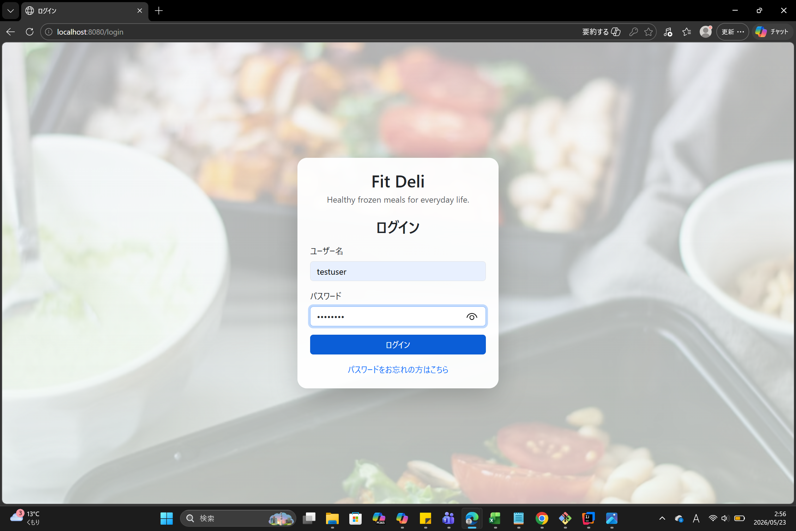
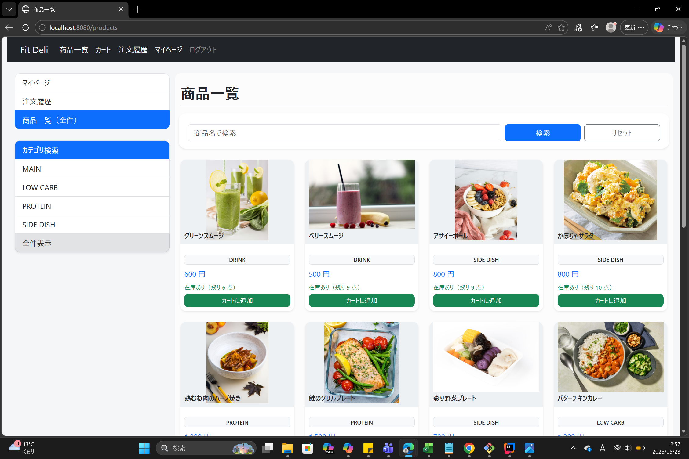
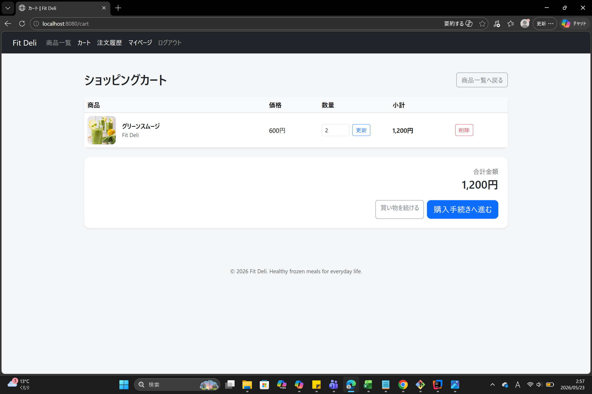
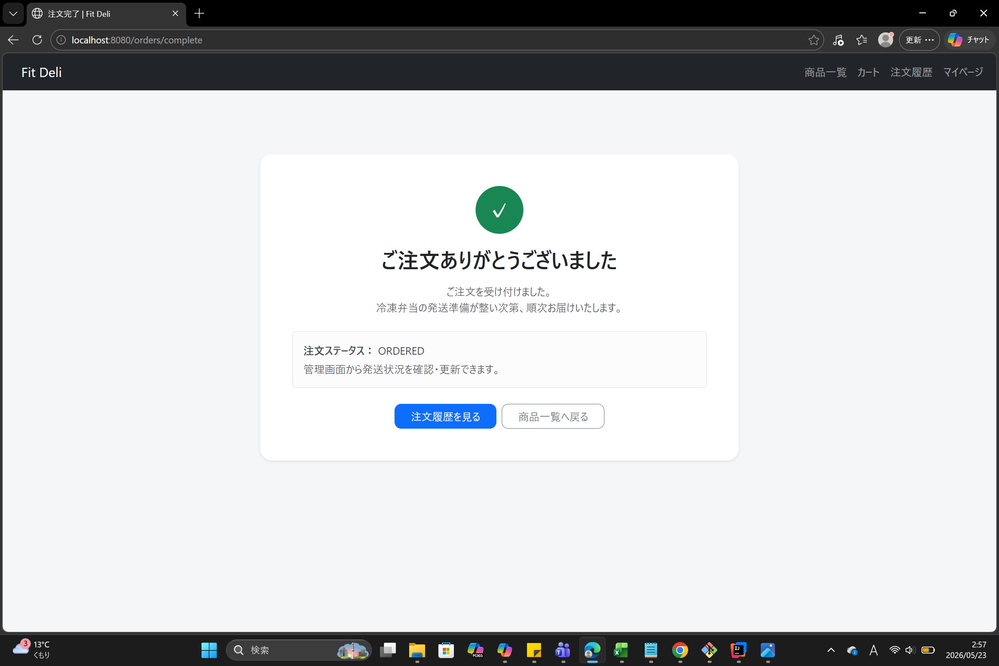
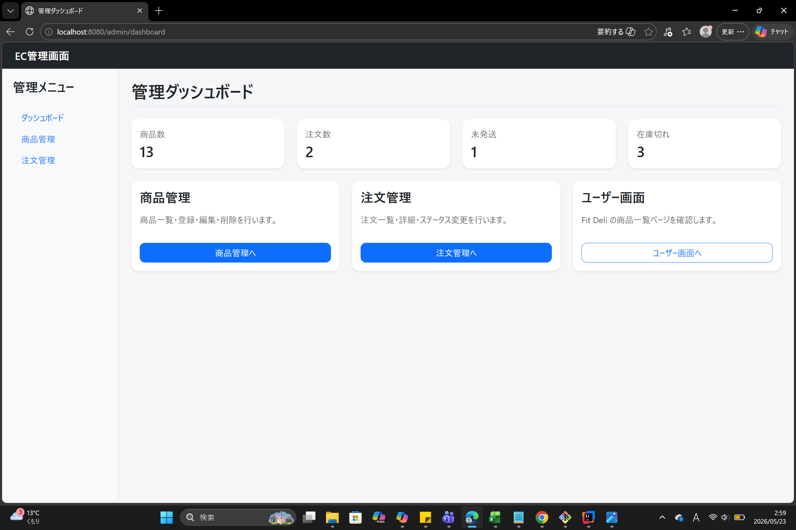
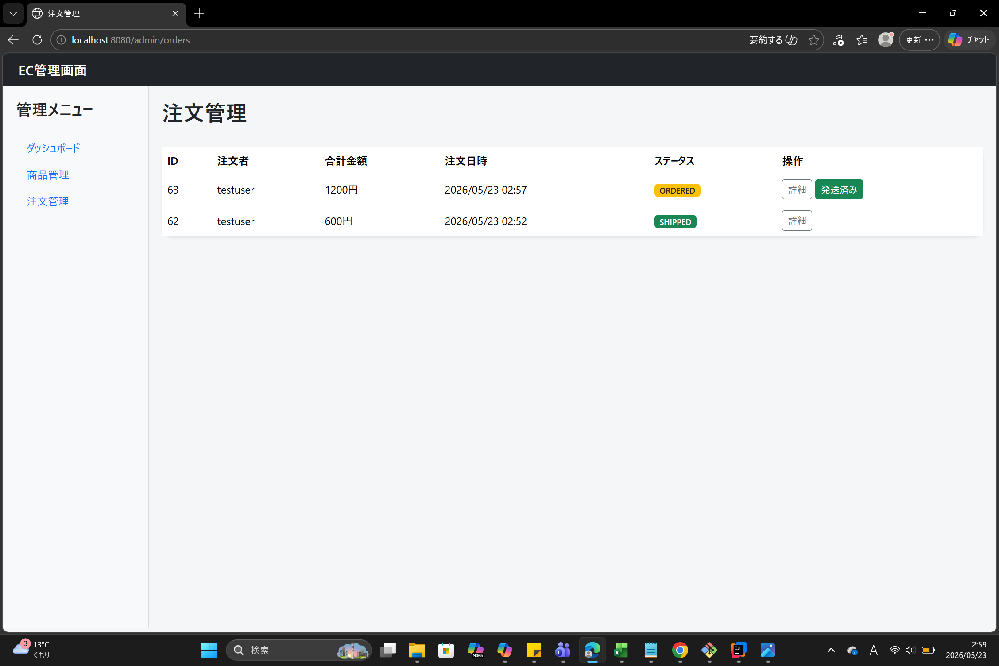

# Fit Deli

Spring Boot + Thymeleaf で開発した食品ECサイトです。

冷凍弁当の販売をイメージし、
商品一覧・カート・注文機能・管理画面を実装しています。

---

## URL

GitHub:
https://github.com/YOSHI110YY/ec-mini

---

## 使用技術

- Java 17
- Spring Boot
- Thymeleaf
- Bootstrap 5
- MySQL
- Spring Security

## 主な機能

### ユーザー機能
- ログイン認証
- 商品検索
- カテゴリ検索
- カート機能
- 注文機能
- 注文履歴確認

### 管理者機能
- 商品CRUD
- 在庫管理
- 注文管理
- 発送ステータス変更
- ダッシュボード表示
- 
## 工夫した点

- Shopify風の食品ECデザインを意識し、UIを統一
- 商品画像・カードUI・注文導線を改善
- レスポンシブ対応を意識してBootstrapで実装
- 注文ステータスと管理画面を連動

---

## 苦労した点

- レイアウト共通化時に循環参照が発生し、
  画面構成の見直しを行った
- 商品画像のパス管理と静的リソース構成の調整
- Thymeleaf のテンプレート構造整理

---

## 起動方法

```bash
git clone https://github.com/YOSHI110YY/ec-mini.git
```

```bash
cd ec-mini
```

```bash
mvn spring-boot:run
```

---

## Screenshots

### Login


### Product List


### Cart


### Order Complete


### Admin Dashboard


### Admin Orders



## 今後改善したい点

- 決済機能の追加
- お気に入り機能
- 商品レビュー機能
- Docker対応
